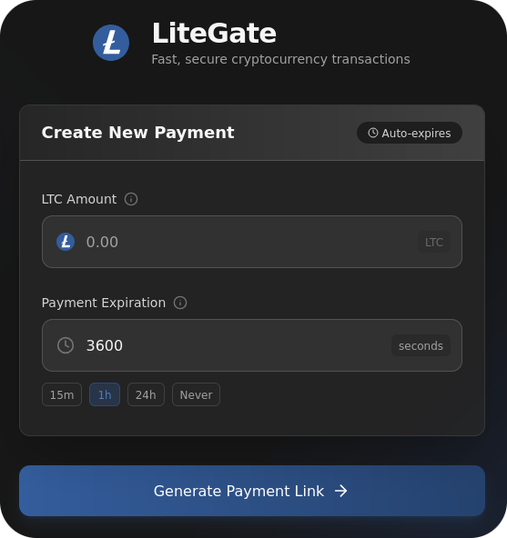
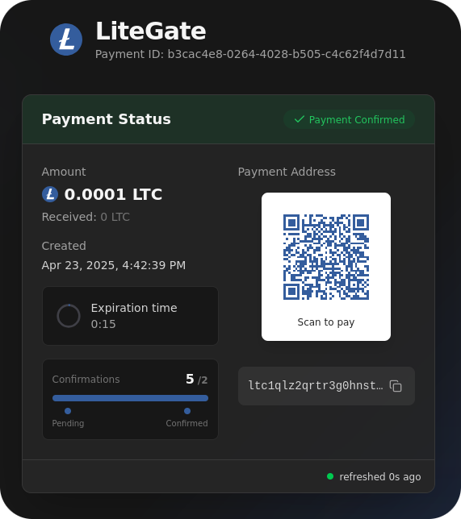

# LiteGate

A minimal Rust + Actix-Web service that issues generated single-use Litecoin (LTC) deposit addresses, tracks incoming payments through an Electrum server, and automatically sweeps confirmed funds into a cold wallet.


<div align="center" style="display: flex; gap: 10px;">
  
  
</div>

## 1 • High-level Architecture

```
┌────────────┐   HTTP/JSON   ┌──────────────┐
│ Front-end  │ ────────────▶ │  Actix-Web   │
└────────────┘               │  routes.rs   │
                             ├──────────────┤
                             │   db.rs      │ ← SQLite (payments.db)
                             ├──────────────┤
 Electrum  ⇆ electrum.rs ⇆   │ sweeper.rs   │ ⇆ Litecoin network
 server                      └──────────────┘
                                    │
                                    ▼
                             ┌──────────────┐
                             │  webhook.rs  │ → External Services
                             └──────────────┘
```

* **/src/routes.rs** – small REST surface (`POST /payments`, `GET /payments/{id}`)  
* **db.rs** – SQLite wrapper (table **payments**)  
* **electrum.rs** – thin Electrum RPC pool (no full node needed)  
* **sweeper.rs** – background worker that "ticks" every 10 s, detects confirmed funds and constructs a sweeping transaction  
* **utils.rs** – key-gen, Bech32 address helpers, AES-GCM encryption for the private key (WIF)
* **webhook.rs** – sends secure notifications when payments are completed

## 2 • Environment

Variable | Purpose
---------|---------
`MAIN_ADDRESS` | Cold wallet the sweeper pays to  
`AES_KEY` | 32-byte hex key for AES-GCM WIF encryption  
`ELECTRUM_HOST / PORT` | Upstream Electrum daemon  
`CONFIRMATIONS` | Blocks required before sweeping (default 2)  
`DB_FILE` | SQLite path (default `payments.db`)  
`PORT` | HTTP port (default 8000)
`WEBHOOK_URL` | URL to send completion notifications to
`WEBHOOK_SECRET` | Secret key for signing webhook payloads

Copy `.env.sample`, fill in real values, then:

```bash
cargo run --release
```

## 3 • API Flows

### 3.1 Happy path

| Step | Request (curl) | Typical Response |
|------|----------------|------------------|
| ① Create payment | `POST /payments`<br>`{ "amount": 0.5, "ttl": 900 }` | `{ "id": "...", "address": "ltc1...", "amount": 0.5, "expires_at": 1713875023 }` |
| ② User sends 0.5 LTC | On-chain | — |
| ③ Poll status | `GET /payments/{id}` | `{ "status":"pending", "confirmations":1, "received":0.5 }` |
| ④ ≥ 2 confs reached | automatic | record in DB marked **completed** |
| ⑤ Sweep | sweeper builds a tx → broadcasts → funds arrive in `MAIN_ADDRESS` |
| ⑥ Webhook | system sends webhook notification to `WEBHOOK_URL` |

### 3.2 Expired / unpaid

* TTL > 0 puts a hard deadline (`expires_at`).  
* On poll, server auto-marks as **expired** if now > `expires_at` and still zero confs.  
* Sweeper ignores expired invoices.

### 3.3 Under- / Over-payment

* **Under-payment**  
  * `sweeper.rs` requires `confirmed_balance ≥ amount` (see `sweep_threshold`).  
  * If less, the invoice stays **pending** and will eventually flip to **expired** after `ttl`.  
  * Nothing is swept; payer must top-up to reach the requested amount.

* **Exact / Over-payment**  
  * As soon as the confirmed balance meets or exceeds the requested `amount`, the sweeper broadcasts a tx.  
  * **All** coins on the deposit address (over-payment included) are forwarded to `MAIN_ADDRESS`.


## 4 • Internal Tick System

* A single Tokio task (`sweeper::start`) runs forever.  
* **Interval**: 10 s (`interval(Duration::from_secs(10))`).  
* **cycle** counter increments each tick.  
* For every payment row:  
  * **Hot entries** (`status == "pending"`) are processed **every tick**.  
  * **Cold entries** (any other status) are processed once per **360 ticks ≈ 1 h** to finalise edge cases or confirm sweeps.

```text
tick = 0,10,20,…         // 10 s cadence
cycle%360==0  ──▶ cold scan
else            ──▶ hot scan only
```

This keeps pending invoices very responsive while preventing useless RPC spam for already-handled ones.

## 5 • Payment States

State | Meaning | Transition
------|---------|-----------
`pending` | Address issued, waiting for funds | → `expired` (TTL up) / `completed` (swept)
`expired` | TTL passed with < needed confirmations | terminal
`completed` | Funds swept to cold wallet | terminal

## 6 • Database Schema

```sql
CREATE TABLE payments(
  id TEXT PRIMARY KEY,
  address TEXT UNIQUE,
  wif_enc TEXT NOT NULL,
  amount REAL,
  status TEXT,            -- pending/expired/completed
  created_at INTEGER,     -- set by trigger in INSERT
  updated_at INTEGER,     -- AUTOINC on updates
  expires_at INTEGER
);
CREATE INDEX idx_payments_expires_at ON payments(expires_at);
```

(All timestamps are Unix seconds.)

## 7 • Security Notes

* Private key (WIF) only ever touches disk encrypted (AES-256-GCM).  
* Sweeper decrypts the WIF in-memory just long enough to sign the sweep.  
* No incoming ports; all chain data fetched via Electrum over TCP/TLS.  
* Webhook payloads are signed with HMAC-SHA256 for security verification.

## 8 • Webhook System

The webhook system notifies external services when a payment is successfully completed and swept.

### 8.1 Configuration

To enable webhooks, set these environment variables:

```
WEBHOOK_URL=https://your-service.com/callback
WEBHOOK_SECRET=your-secure-secret-key
```

- If `WEBHOOK_URL` is not provided or empty, no webhooks will be sent.
- `WEBHOOK_SECRET` is used to generate HMAC signatures for security.

### 8.2 Webhook Payload Structure

When a payment status changes to `completed`, a POST request is sent to the webhook URL with this payload:

```json
{
  "event": "payment.completed",
  "payment": {
    "id": "a1b2c3d4-e5f6-...",
    "address": "ltc1...",
    "amount": 0.5,
    "status": "completed",
    "created_at": 1713874123,
    "updated_at": 1713875023,
    "expires_at": 1713878023
  }
}
```

### 8.3 Webhook Authentication

Each webhook is signed with an HMAC-SHA256 signature using your `WEBHOOK_SECRET`. The signature is sent in the `X-Signature` HTTP header.

To verify the webhook's authenticity:

1. Get the raw request body as a string
2. Get the signature from the `X-Signature` header
3. Calculate the HMAC-SHA256 of the raw body using your secret key
4. Compare the calculated signature with the received one

Example verification code in Node.js:

```javascript
const crypto = require('crypto');

function verifyWebhook(body, signature, secret) {
  const computedSignature = crypto
    .createHmac('sha256', secret)
    .update(body)
    .digest('hex');
  
  return crypto.timingSafeEqual(
    Buffer.from(computedSignature, 'hex'),
    Buffer.from(signature, 'hex')
  );
}

// In your Express handler:
app.post('/callback', (req, res) => {
  const signature = req.headers['x-signature'];
  const rawBody = req.rawBody; // You'll need raw body middleware
  
  if (!verifyWebhook(rawBody, signature, process.env.WEBHOOK_SECRET)) {
    return res.status(401).send('Invalid signature');
  }
  
  // Process the webhook
  const data = JSON.parse(rawBody);
  console.log(`Payment ${data.payment.id} completed!`);
  
  res.status(200).send('OK');
});
```

### 8.4 Security Best Practices

- Use HTTPS for your webhook endpoint
- Keep your webhook secret secure and don't share it
- Implement signature verification to prevent forgery
- Add request timeout handling in your webhook receiver
- Consider implementing retry logic for failed webhook deliveries

## 9 • What to Expect

* **10-second latency** on invoice updates; **≈ 1–3 min** until sweep after required confirmations.  
* If Electrum is down the gateway continues issuing addresses; sweeper resumes when connectivity is back.  
* The service is *stateless* beyond `payments.db`; you can safely redeploy or run multiple front-end instances pointing to the same DB.
* Webhooks are sent immediately after a payment is marked as completed.